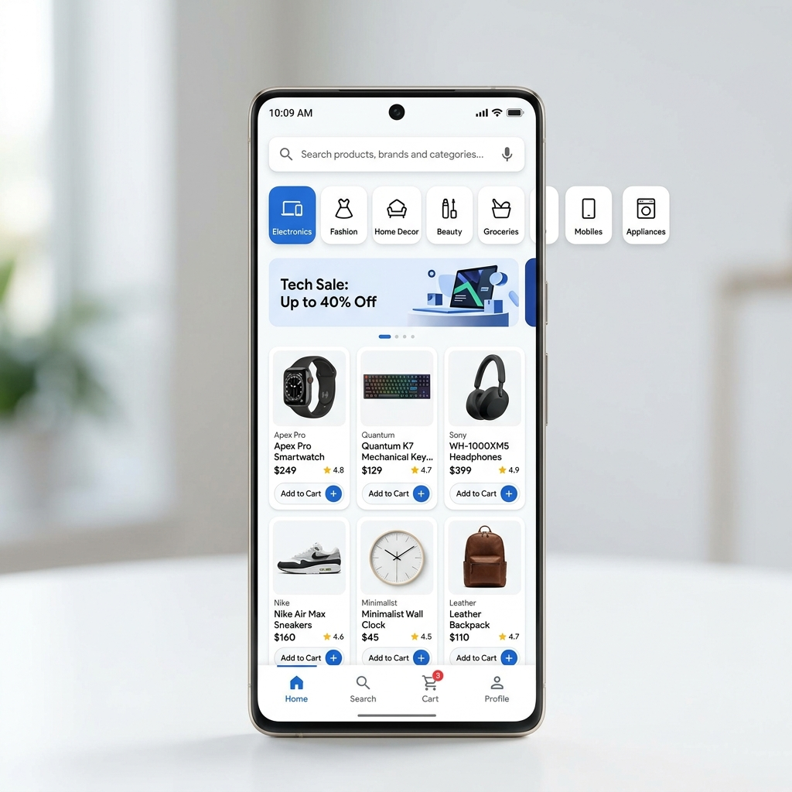

# 🛍️ E-Saudagar

**E-Saudagar** is a premium, production-ready e-commerce mobile application built with Flutter and Firebase. It offers a seamless shopping experience with features like real-time product filtering, a multi-language interface (English & Bengali), and a modern, high-performance UI.



## ✨ Features

- **🚀 Premium UI/UX**: Clean, modern design with smooth transitions and high-fidelity mockups.
- **🔍 Smart Search & Filtering**: Real-time product search and dynamic category-based filtering.
- **🛒 Advanced Cart System**: Real-time cart badge indicators, quantity management, and a persistent wishlist.
- **🌍 Multi-Language Support**: Fully localized in **English** and **Bengali** (বাংলা).
- **🔥 Firebase Integration**: Secure authentication (Email/Password) and real-time data syncing via Cloud Firestore.
- **📸 High-End Image Handling**: Multi-image product views with pinch-to-zoom capabilities.
- **📦 Order Tracking**: Interactive status timeline (Processing → Shipped → Delivered).
- **✨ Polish & Performance**: Shimmer loading effects, pull-to-refresh, and optimized state management using Riverpod.

## 🛠️ Tech Stack

- **Framework**: [Flutter](https://flutter.dev/)
- **State Management**: [Riverpod](https://riverpod.dev/)
- **Backend**: [Firebase](https://firebase.google.com/) (Auth, Firestore, Storage)
- **Image Loading**: [Cached Network Image](https://pub.dev/packages/cached_network_image)
- **Local Storage**: [Shared Preferences](https://pub.dev/packages/shared_preferences)
- **Visuals**: [Shimmer](https://pub.dev/packages/shimmer), [Photo View](https://pub.dev/packages/photo_view)

## 🚀 Getting Started

### Prerequisites

- Flutter SDK (v3.0.0 or higher)
- Firebase Account & Project setup

### Installation

1. **Clone the repository**:
   ```bash
   git clone https://github.com/Rejuyan/eSaudagar.git
   cd eSaudagar
   ```

2. **Install dependencies**:
   ```bash
   flutter pub get
   ```

3. **Firebase Setup**:
   - Create a new Firebase project in the [Firebase Console](https://console.firebase.google.com/).
   - Follow the FlutterFire CLI instructions to configure your app:
     ```bash
     flutterfire configure
     ```

4. **Run the app**:
   ```bash
   flutter run
   ```

## 📸 Screenshots

| Home & Categories | Product Details | Cart & Checkout |
|:---:|:---:|:---:|
| Modern Grid View | Pinch-to-Zoom Images | Smooth Checkout Flow |

## 🤝 Contributing

Contributions are welcome! If you have any suggestions or find a bug, please open an issue or submit a pull request.

## 📄 License

This project is licensed under the MIT License - see the [LICENSE](LICENSE) file for details.

---
Developed with ❤️ by [Rejuyan](https://github.com/Rejuyan)
